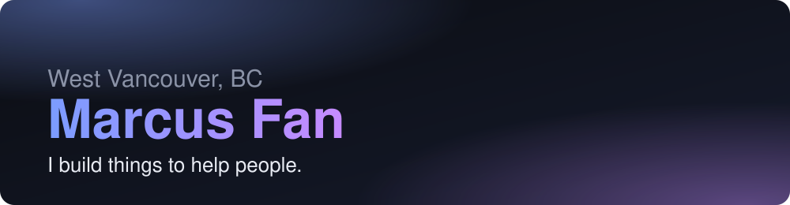

### Hi, I'm Marcus

I'm a software engineering and business student exploring how new technology can help everyday professionals, and an entrepreneur working to help the care and healthcare sector support its professionals and the people they serve, at free or affordable rates.

**[🌐 Portfolio](https://mfan88.github.io)** · **[💼 LinkedIn](https://www.linkedin.com/in/marcusfan888/)**

 

## What I've been building

<table>
  <tr>
    <td><b><a href="https://github.com/mfan88/GMAPORTAL">GMA Upload Portal</a></b></td>
    <td>A secure portal that takes a family's assessment video from one private link to the clinic's files and spreadsheet, built with the Developmental Disabilities Association.</td>
  </tr>
  <tr>
    <td><b>NavigateMyDay</b></td>
    <td>An iOS app that turns calendar events into directions, with an Assisted Care mode for people who need help getting around.</td>
  </tr>
</table>

Interactive demos of each are on the **[portfolio](https://mfan88.github.io)**.

## Tech I use

Outside of work I like volunteering with people with special needs.
